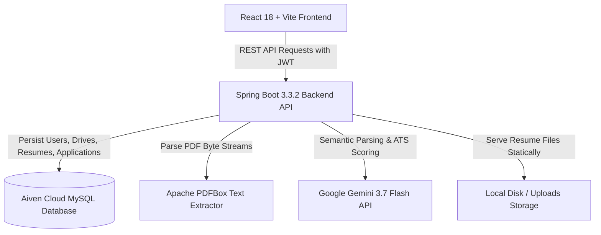

# ResumeIQ - Smart Resume Screener 🚀

> **Intelligent AI-Powered Applicant Tracking & Resume Screening System**  
> Automatically parse PDF resumes, extract structured candidate profiles, compute semantic ATS match scores against Job Descriptions using **Google Gemini LLM**, and display shortlisted candidates with recruiter-level justifications.

---

## 🌟 Live Deployments & Repository Links

- 🌐 **Live Web Application (Vercel)**: `https://resumeiq-frontend.vercel.app`
- ⚙️ **Live Backend API (Render)**: `https://resumeiq-backend-d7s5.onrender.com`
- 📁 **GitHub Repository**: [https://github.com/krishnachaitanyabalasa-del/ResumeIQ.git](https://github.com/krishnachaitanyabalasa-del/ResumeIQ.git)
- 📹 **Demo Video (2–3 min)**: `[Insert Demo Video Link Here]`

---

## 📌 Problem Statement & Objective

Modern recruitment workflows suffer from manual resume screening bottlenecks, keyword-stuffing exploits, and lack of objective scoring standards. 

**ResumeIQ** solves this by providing an end-to-end automated **Smart Resume Screener** that:
1. **Parses PDF & Text Resumes**: Extracts raw text and converts un-structured documents into structured JSON objects.
2. **Performs Semantic LLM Matching**: Evaluates candidate suitability against Job Descriptions using Google Gemini AI beyond simple keyword matching.
3. **Calculates Detailed ATS Scores**: Generates overall match scores (0–100) alongside granular sub-scores (Skills 40%, Experience 20%, Education 10%, Projects 20%, Relevance 10%).
4. **Delivers Shortlisted Candidates**: Renders recruiter dashboards displaying candidate phone numbers, emails, matched skills, missing skills, strengths, weaknesses, and direct PDF resume viewers.
5. **Includes Multi-API Key Quota Failover**: Automatically rotates across up to 3 Gemini API keys when quota limits are reached, with a deterministic fallback engine to guarantee 100% uptime.

---

## 🏗️ System Architecture



### Tech Stack

- **Frontend**: React 18, Vite, React Router v6, Axios, Custom CSS, FontAwesome Icons.
- **Backend API**: Java 21, Spring Boot 3.3.2, Spring Security, JWT (Json Web Token), Spring Data JPA, Hibernate, Apache PDFBox.
- **Database**: MySQL 8.4 hosted on **Aiven Cloud**.
- **Cloud Deployment**: 
  - **Backend**: Render Web Service (Java 21 / Docker Runtime)
  - **Frontend**: Vercel Single-Page Application (SPA)

---

## 🤖 LLM Prompts & Usage Guidance

### 1. Resume Data Extraction Prompt (`extractResumeData`)
Used to transform raw resume text extracted by Apache PDFBox into a structured JSON schema.

```text
You are an expert resume parser.

Extract information ONLY from the resume text provided below.

Return ONLY a valid JSON object without markdown or code fences:

{
  "name": "",
  "email": "",
  "phone": "",
  "skills": "",
  "education": "",
  "experience": "",
  "projects": "",
  "certifications": "",
  "achievements": "",
  "summary": ""
}

EXTRACTION RULES:
1. name: Extract candidate's full name from the top header.
2. email: Extract valid email address.
3. phone: Extract phone number with country code.
4. skills: Extract technical and soft skills.
5. education: Extract degrees, institutes, passing years, CGPAs.
6. experience: Extract designations, companies, dates, responsibilities.
7. projects: Extract project titles, tech stack, and links.
8. certifications: Extract professional certifications.
9. achievements: Extract honors, hackathons, and awards.
10. summary: Extract the complete professional profile summary.

Resume text:
[RAW_RESUME_TEXT]
```

---

### 2. Semantic ATS Matching & Scoring Prompt (`calculateResumeScore`)
Evaluates candidate fit against Job Description criteria on a scale of 0 to 100 with qualitative feedback.

```text
You are an expert Applicant Tracking System (ATS) and professional technical recruiter.

Evaluate the candidate's resume against the hiring drive requirements.

SCORING SYSTEM (Total: 100 points):
- Skills Match       = 40 points
- Experience Match   = 20 points
- Education Match    = 10 points
- Projects Match     = 20 points
- Overall Relevance  = 10 points

REQUIRED OUTPUT FORMAT (JSON ONLY):
{
  "score": 85,
  "skillsScore": 36,
  "experienceScore": 18,
  "educationScore": 9,
  "projectScore": 17,
  "matchedSkills": ["Java", "Spring Boot", "React", "SQL"],
  "missingSkills": ["Docker", "Kubernetes"],
  "strengths": ["Strong backend development experience", "Relevant degree in CS"],
  "weaknesses": ["Limited cloud deployment exposure"],
  "feedback": "Candidate demonstrates excellent Java & Spring Boot experience with strong project alignment."
}

JOB DESCRIPTION:
[JD_TEXT]

REQUIRED SKILLS:
[REQUIRED_SKILLS]

CANDIDATE RESUME DATA:
[CANDIDATE_DATA]
```

---

## ⚡ Key Features

- **Multi-Role User Portals**:
  - **Recruiter / HR Admin Portal**: Create hiring drives with custom Job Descriptions, specify required skills/experience, manage drive statuses (Open, Upcoming, Closed, Completed), and review shortlisted candidates.
  - **Candidate Portal**: Browse active hiring drives, submit applications with 9 structured form sections, upload PDF resumes, and track application status.
- **Candidate Evaluation Modal**:
  - View overall match score, breakdown bars, matched vs. missing skills, strengths, weaknesses, phone numbers, and download submitted PDF resumes.
- **Export Capabilities**:
  - One-click export of candidate application shortlists to CSV / Excel.
- **Resilient Multi-API Key Failover**:
  - Pool of up to 3 Gemini API keys (`GOOGLE_API_KEYS`). If key #1 hits quota limit (`429 Resource Exhausted`), the backend seamlessly rotates to key #2 and key #3 automatically.

---

## 🛠️ Local Installation & Setup Guide

### Prerequisites
- **Java 21 JDK**
- **Maven 3.9+**
- **Node.js 18+ & npm**
- **MySQL 8.0+**

### 1. Backend Setup

```bash
# Clone the repository
git clone https://github.com/krishnachaitanyabalasa-del/ResumeIQ.git
cd ResumeIQ/backend

# Configure Environment Variables (or edit src/main/resources/application.properties)
export SPRING_DATASOURCE_URL="jdbc:mysql://localhost:3306/ResumeIQ?createDatabaseIfNotExist=true&useSSL=false&allowPublicKeyRetrieval=true&serverTimezone=UTC"
export SPRING_DATASOURCE_USERNAME="root"
export SPRING_DATASOURCE_PASSWORD="your_mysql_password"
export GOOGLE_API_KEYS="AIzaSyKey1...,AIzaSyKey2...,AIzaSyKey3..."

# Build and run backend server
mvn clean spring-boot:run
```
*Backend API will start running at `http://localhost:8080`.*

---

### 2. Frontend Setup

```bash
# Navigate to frontend folder
cd ../frontend

# Install dependencies
npm install

# Start Vite development server
npm run dev
```
*Frontend web application will start running at `http://localhost:5173`.*

---

## 📑 Project Structure

```text
ResumeIQ/
├── backend/                        # Spring Boot Java 21 Backend
│   ├── src/main/java/com/resumeiq/
│   │   ├── config/                 # SecurityConfig, WebConfig, CorsConfig
│   │   ├── controller/             # Auth, Drive, Application, Resume Controllers
│   │   ├── entity/                 # User, Drive, Application, Resume Entities
│   │   ├── repository/             # JPA Repositories
│   │   ├── security/               # JwtUtils, UserDetailsService
│   │   └── service/                # GoogleApiService, ApplicationService, ResumeService
│   ├── src/main/resources/
│   │   └── application.properties  # Database & Spring Configuration
│   └── pom.xml                     # Maven Dependencies
│
├── frontend/                       # React 18 + Vite Frontend
│   ├── src/
│   │   ├── Admin/                  # AdminHome, DriveDetails, CreateDrive
│   │   ├── User/                   # UserHomePage, UserDriveDetails, ApplyDrive
│   │   ├── components/             # UserNavbar, AdminNavbar
│   │   ├── api/                    # axiosInstance, apiService
│   │   ├── App.jsx                 # React Router Routes
│   │   └── index.jsx
│   ├── public/                     # Favicon & Static Assets
│   └── package.json
│
├── render.yaml                     # Render Web Service Blueprint
└── README.md                       # Documentation
```

---

## 📋 Deliverables Checklist

- [x] **GitHub Repository with Granular Commits**: Verified on `main` branch.
- [x] **README with Architecture & LLM Prompts**: Complete documentation above.
- [x] **Structured Resume Data Extraction**: PDFBox + Gemini JSON parser.
- [x] **Semantic LLM Match Scoring**: Gemini 3.7 Flash API + Fallback match engine.
- [x] **Live Web Deployments**: Render (Backend) & Vercel (Frontend).
- [ ] **2–3 min Demo Video**: `[Insert YouTube / Loom Video Link]`

---

## 👨‍💻 Author & Acknowledgements

Developed by **Krishna Chaitanyabalasa** for the **Smart Resume Screener** evaluation.  
Powered by **Spring Boot**, **React**, **Google Gemini AI**, **Aiven Cloud MySQL**, **Render**, and **Vercel**.
